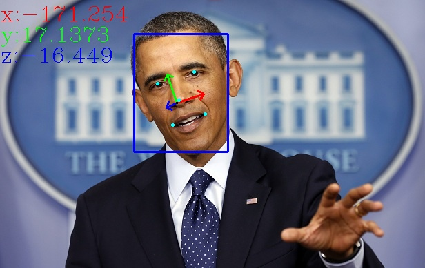

# MTCNN
[](LICENSE)


## 概述

[MTCNN](https://kpzhang93.github.io/MTCNN_face_detection_alignment/index.html)是[Kaipeng Zhang](https://kpzhang93.github.io/)等人提出的多任务级联卷积神经网络进行人脸检测的方法，它能够同时输出人脸的检测框以及5个关键点，是开源中效果最好的人脸检测器，[在fddb上有100个误报时的检出率高达90%以上](https://github.com/imistyrain/fddb-windows)，作者提供的版本为[matlab版](https://github.com/kpzhang93/MTCNN_face_detection_alignment),它采用三级级联架构分阶段逐步过滤人脸，在CPU上可达到实时和较高的准确率，是目前人脸检测领域的baseline.


由于各种不同的姿态、光照和遮挡等，人脸检测和对齐在非控制环境下非常具有挑战性. 最近的研究表明使用深度学习能够取得惊艳的性能，MTCNN提出了一个多任务级联框架其发掘了检测和对齐的内在联系来提升性能. 特别的，其通过由粗到细的方式设计了3个精心设计的级联式的网络来检测脸和关键点，此外还提出了一种在线难例挖掘的策略进一步提升性能. 其不仅能有实时的速度(>30FPS)还在fddb和WIDER FACE等人脸检测评估集和AFLW人脸关键点任务上取得了最好的性能.

由Viola和Jones提出了使用Haar特征和AdaBoost的级联检测器(OpenCV实现并默认使用的[VJ检测器](https://blog.csdn.net/lixiaoguang20/article/details/78403682?utm_medium=distribute.pc_relevant.none-task-blog-BlogCommendFromMachineLearnPai2-2.nonecase&depth_1-utm_source=distribute.pc_relevant.none-task-blog-BlogCommendFromMachineLearnPai2-2.nonecase))在实时下仍有很好的效果，但是很多论文都提到其在实际使用时会退化即便使用更高级的特征和分类器也不能缓解.可变形模型(DPM)取得了可观的进步但是它的运算量很大并且训练时需要额外的标注. 最近深度学习的方法被引入到人脸检测中来，然而由于复杂的网络设计，实际使用中非常耗时并且没有考虑到框和点的联系.很少有工作同时解决人脸检测和对齐这两个问题,并且现存的工作也很有多问题，性能和效果都不太好. 难例挖掘对于提升检测器性能非常关键，传统的方法都使用离线的方式，需要大量的手工操作，有必要设计一种自动选择难例样本的方法.

MTCNN提出了一个新的统一的包含3个网络的多任务学习框架来融合检测和对齐两个任务, 在第一个阶段使用浅层网络快速筛选出所有可能的候选滑窗，在第二个阶段使用更复杂的网络拒绝大量非人脸滑窗，在最后一个阶段使用更有力的网络来进一步修正框并输出5个点的位置.得益于这种多任务学习的方式，MTCNN性能提升非常明显, 其三个主要贡献在于:

1. 提出了一种新的联合人脸检测和对齐的级联CNN框架，并且为实时性能精心设计了轻量级的网络结构
2. 提出了一种有效的在线难例挖掘来提高性能
3. 在具有挑战性的评估集上进行了大量的实验，并取得了最好的性能

本项目集成了其在[OpenCV dnn](https://github.com/imistyrain/MTCNN/tree/master/cpp)、[pytorch](https://github.com/imistyrain/MTCNN/tree/master/pytorch)、[caffe](https://github.com/imistyrain/MTCNN/tree/master/caffe)、[ncnn](https://github.com/imistyrain/MTCNN/tree/master/ncnn)和[pycaffe](https://github.com/imistyrain/MTCNN/tree/master/python-caffe)、[tensorflow](https://github.com/imistyrain/MTCNN/tree/master/tensorflow)等框架以及[不依赖任何第三方库](https://github.com/imistyrain/MTCNN/tree/master/MTCNN-light)的使用，可以跨Windows、Linux和Mac运行, 此外还提供了[android端apk包](https://github.com/imistyrain/MTCNN/releases)，其可以在高通845的手机上实时运行.
在cpp工程里还提供了基于5个点进行姿态估计的示例, 最终的效果如图所示:



## 使用方法

### python
```
pip install opencv-python>=3.4.8.29
python python/demo.py
```
pytorch
```
python pytorch/demo.py
```

## 原理分析和讲解

[MTCNN讲解](https://zhuanlan.zhihu.com/p/92177798)

目标检测本质上来说上目标区域内特征与模板权重的点乘操作

* 为什么需要对图片做“金字塔”变换？
* MTCNN算法可以接受任意尺度的图片，为什么？
* 什么叫边框回归？在MTCNN怎么利用边框回归的结果？为什么可以这样做？
* 哪些步骤是影响MTCNN的计算效率的关键？以及有哪些优化思路？

[检测过程可视化分析](https://github.com/xuexingyu24/MTCNN_Tutorial/blob/master/MTCNN_Step_by_Step.ipynb)

### C++

1.首先按照[MRHead](https://github.com/imistyrain/MRHead)描述的方法配置好opencv跨版本和平台编译环境

2.配置依赖的库，不是所有的库都是必须的，如果只是想看看效果，第一个只配置opencv就可以了.

- [cpp](cpp)使用opencv的dnn模块进行预测，需要使用3.4.*以上，或者3.*以上并自行打开开关编译dnn支持，只要配置好opencv即可运行

- [MTCNN-light](MTCNN-light)使用[openblas](https://github.com/xianyi/OpenBLAS)进行运算加速，在[github](https://github.com/xianyi/OpenBLAS/releases/)下载其预先编译好的库即可
, 比如[OpenBLAS-0.3.10-x64.zip](https://github.com/xianyi/OpenBLAS/releases/download/v0.3.10/OpenBLAS-0.3.10-x64.zip), 其可以直接移植到Android和iOS上.

- [caffe](caffe)需要依赖[caffe](https://github.com/BVLC/caffe)1.0，可参考[教程](http://blog.csdn.net/akashaicrecorder/article/details/71016942)

 **Windows**

	git clone https://github.com/imistyrain/ssd
	cd ssd
	script\build_win.cmd
 **Ubuntu & Mac**

	git clone https://github.com/imistyrain/ssd
	cd ssd
	mkdir build
	cd build
	cmake ..
	make -j4
	sudo make install

* [ncnn](ncnn)使用[ncnn](https://github.com/Tencent/ncnn)进行加速，其在手机端进行了大量的优化，Windows端并没有太多的优化效果可能不明显，但是[手机端](https://github.com/imistyrain/MTCNN/releases/download/1.0/mtcnn.apk)速度可以达到实时

		git clone https://github.com/Tencent/ncnn
		cd ncnn
		mkdir build
		cmake -DCMAKE_INSTALL_PREFIX=/usr/local ..
		make -j4
		sudo make install

3.配置好以上环境后

 **Windows**

打开MTCNN.sln，把mtcnn设为启动项运行即可

 **Ubuntu & Mac**

	mkdir build
	cd build
	cmake ..
	make -j4
	./cpp/mtcnn

## 训练

首推pytorch版的[MTCNN_Tutorial](https://github.com/xuexingyu24/MTCNN_Tutorial), 有详细的[教程](https://github.com/xuexingyu24/MTCNN_Tutorial/blob/master/MTCNN_Training_Step_by_Step.ipynb)描述每一步.

训练日志见[train/train_log.txt](train/train_log.txt)
```
PNet: val Loss: 0.0099 accuracy: 0.9424 cls Loss: 0.1578 offset Loss: 0.0112
RNet: val Loss: 0.0056 accuracy: 0.9820 cls Loss: 0.0533 offset Loss: 0.0075
ONet: val Loss: 0.0043 accuracy: 0.9891 cls Loss: 0.0291 offset Loss: 0.0041 landmark Loss: 0.0004
```
其次是caffe版
* [Joint-Face-Detection-and-Alignment](https://github.com/luoyetx/Joint-Face-Detection-and-Alignment)
需要自己添加源码重新编译，较为繁琐，但是数据生成是并行的，可以减少准备数据耗时且部署方便，如果只想看训练日志的话可以参考
* [MTCNN训练总结](https://github.com/luoyetx/Joint-Face-Detection-and-Alignment/blob/master/summary.md)
## 性能分析

```
pip install snakeviz
#comment imshow in python/demo.py
python -m cProfile -o mtcnn.prof python/demo.py
snakeviz mtcnn.prof
```

各阶段的计算量和参数量


裁剪加速
[Pruning_MTCNN_MobileFaceNet_Using_Pytorch](https://github.com/xuexingyu24/Pruning_MTCNN_MobileFaceNet_Using_Pytorch)

| Mobel | Weight Size (base vs pruned) | Accuracy (base vs pruned) | Time(speed up) | 
|  :------:     | :---------: | :---------: |:---------: |
|   PNet     | 28.8KB vs  9KB    |  98.24 vs 98.9 | 1.6x |
|   RNet     | 403.5KB vs 138.6KB     |  97.85 vs 96.54 | 1.4x |
|   ONet     | 1.6MB vs 658.6KB     |  98.8 vs 98.9 | 2.1x |

裁剪训练日志见[train/prune_log.txt](train/prune_log.txt)

```
PNet:
initial test :: accuracy: 0.9431 loss: 0.0101 cls loss: 0.1560 offset loss: 0.0116
total model conv2D filters are:  58
Number of iterations to prune 50.0 % filters: 3
iter2. after retrain :: accuracy: 0.9304 loss: 0.0113 cls loss: 0.1891 offset loss: 0.0126

RNet:
initial test :: accuracy: 0.9693 loss: 0.0076 cls loss: 0.0958 offset loss: 0.0094
total model conv2D filters are:  140
Number of iterations to prune 50.0 % filters: 4
iter3. after retrain :: accuracy: 0.9682 loss: 0.0072 cls loss: 0.0950 offset loss: 0.0088

ONet:
initial test :: accuracy: 0.9533 loss: 0.1301 cls loss: 0.1145 offset loss: 0.0912 landmark loss: 0.0244
total model conv2D filters are:  288
Number of iterations to prune 50.0 % filters: 4
iter3. after retrain :: accuracy: 0.9916 loss: 0.0041 cls loss: 0.0245 offset loss: 0.0040 landmark loss: 0.0004
```
## Notes

[MTCNN](https://kpzhang93.github.io/MTCNN_face_detection_alignment/index.html)是采用matlab训练出来的，其默认的存储方式为列主序，而且颜色为RGB，和opencv中常用的BGR有不同，遇到输出结果不对时先要检查预处理是否正确.
在[caffe/MTCNN.cpp](https://github.com/imistyrain/MTCNN/blob/8fc7ed67214ce53b690efe99ee368ab75d71b38b/cpp/MTCNN.cpp#L356)中可以找到

	image.convertTo(sample_single, CV_32FC3);
	cv::cvtColor(sample_single, sample_single, cv::COLOR_BGR2RGB);
	sample_single = sample_single.t();
	
在[python](python-caffe/MtcnnDetector.py)中的处理

	img = cv2.cvtColor(img,cv2.COLOR_BGR2RGB)
	...

	im_data_out = im_data_out.transpose((0,3,2,1)) 
特别注意transpose这，cv2读进来是HWC的顺序，它给交换成了NCWH, 和常用的NCHW还是有区别的.

### 如何生成MTCNN-light所需的txt文件

参见[python/caffemodel2txt.py](python/caffemodel2txt.py)
