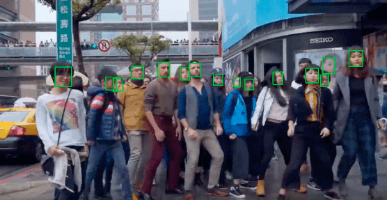

# MTCNN_Tutorial-
As a series of tutorials on the most popular deep learning algorithms for new-entry deep learning research engineers, MTCNN has been widely adopted in industry for human face detection task which is an essential step for subsquential face recognition and facial expression analysis. This tutorial is designed to explain how to implement the algorithm. In this tutorial, developers will learn how to build MTCNN model for face detection task.

## Results 

## Test Image 
python MTCNN.py --test_image 'images/s_l.jpg' --mini_face 20

## Test Video 
python Video.py --scale 1 --mini_face 32

## How to implement MTCNN 
Please go through the details on MTCNN_Step_by_Step.ipynb

## How to train MTCNN 
Please go through the details on MTCNN_Training_Step_by_Step.ipynb 

## Reference 
1. [Joint Face Detection and Alignment using Multi-task Cascaded Convolutional Networks](https://kpzhang93.github.io/MTCNN_face_detection_alignment/paper/spl.pdf)
2. Coding is heavily based on [Dface](https://github.com/kuaikuaikim/DFace)
